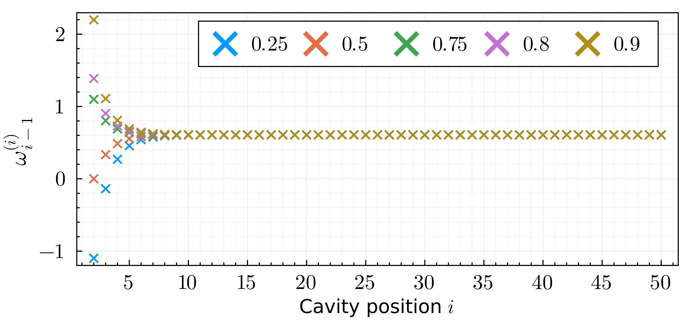
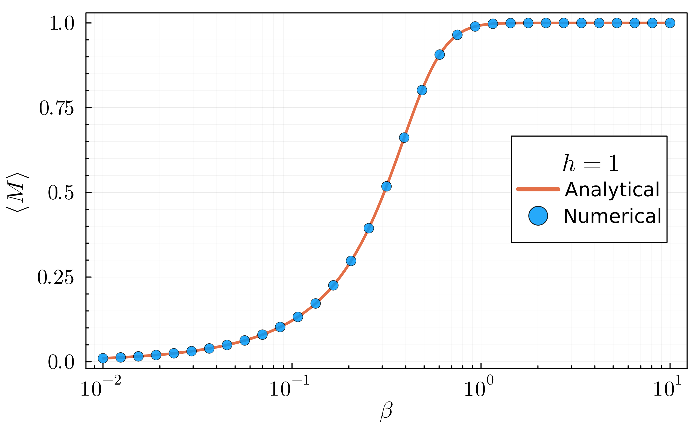

# Belief propagation algorithm for the 1D Ising chain

Here we apply the belief propagation algorithm (BPA) to the 1D Ising chain and use it to compute the mean magnetization in the thermodynamic limit.

The task is divided into two main parts:
1. Show that the recursive relation between the cavity parameters has a fixed point which is achieved after a few iterations and independently of the initialization.
2. Find the fixed point for the cavity parameters for any given inverse thermal energy and external magnetic field strength, and use it to compute the mean magnetization.

Each of these tasks is performed in a Jupyter notebook. For both of these, the instructions are:
1. Run the first code cell loading the modules and defining the necessary functions.
2. Run the cell generating the plot.

## 1. Cavity parameters vs. cavity position

In order to obtain the cavity parameters, we first need to specify the following inputs
```julia
β  # Inverse thermal energy.
h  # External magnetic field strength.
N  # Nodes in chain.
prob1  # P(σ1 = +1) with cavity at 2.
```
Afterwards, we define the recursive relation between them through the function
```julia
recursive_omega(ω, β, h) = h + (1/(2*β))*log( cosh(β*(ω+1))/cosh(β*(ω-1)) )
```
and the rest of the process consists on initializing the first cavity parameter, and computing the rest iteratively
```julia
function get_cavity_params(β, h, N, prob1; up=true)
    
    ω_list = Array{Float64}(undef, N-1)
    
    # Compute the first cavity parameter from the cavity
    # probability, assuming it corresponds to σ1 = +1.
    # If probability was given for σ1 = -1, correct it.
    
    ω_list[1] = (1/(2*β))*log(prob1/(1 - prob1))
    (!up) && (ω_list[1] = -1. *ω_list[1])
    
    # Compute remaining ω's.
    
    for i ∈ 2:N-1
        ω_list[i] = recursive_omega(ω_list[i-1], β, h)
    end
    
    return ω_list
end
```



## 2. Mean magnetization vs. inverse thermal energy

The main task in this part consists of computing the fixed point. For this, we need the following inputs:
```julia
β  # Inverse thermal energy.
h  # External magnetic field strength.
max_iter  # Maximum number of iterations to try to reach the fixed point.
precision  # Maximum decimal place for which we compare any two consecutive values.
```
Then, the fixed point is found through the function
```julia
function get_fixed_point(β, h; max_iter=500, precision=10)
    
    # Assuming uniform distribution for P(2)(σ1).
    ω = 0
    
    # Truncated value at the given precision.
    ω_trunc = trunc(ω, digits=precision)
    
    for i in 1:max_iter
        
        # Get new value and check 
        # difference at precision.
        ω2 = recursive_omega(ω, β, h)
        ω2_trunc = trunc(ω2, digits=precision)
                
        # Precision is achieved.
        ((ω2_trunc - ω_trunc) == 0) && break

        # Update values
        ω = ω2
        ω_trunc = ω2_trunc
        
        # Let the user know if the desired precision was not achieved.
        (i == max_iter) && println("Precision not achieved.")
    end
    
    return ω
end
```
Through this function, the mean magnetization can be obtained via
```julia
function get_mean_magnetization(β, h; max_iter=500, precision=10)
    ω_fixed = get_fixed_point(β, h, max_iter=max_iter, precision=precision)    
    M = tanh(β*(2. *ω_fixed - h)) 
    return M
end
```


