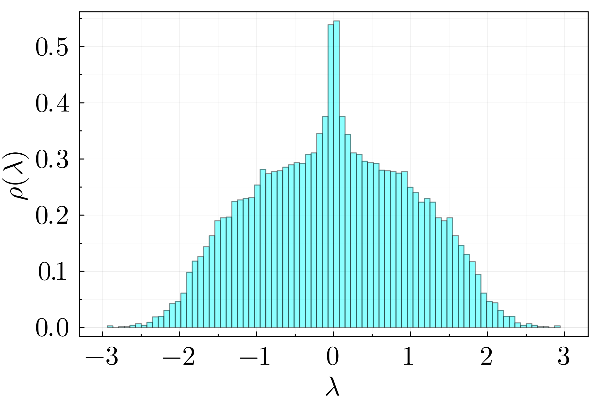
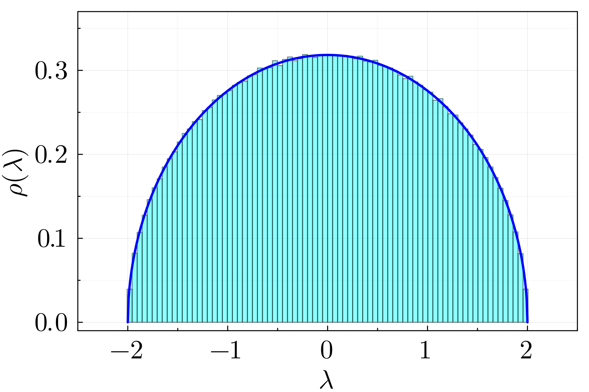
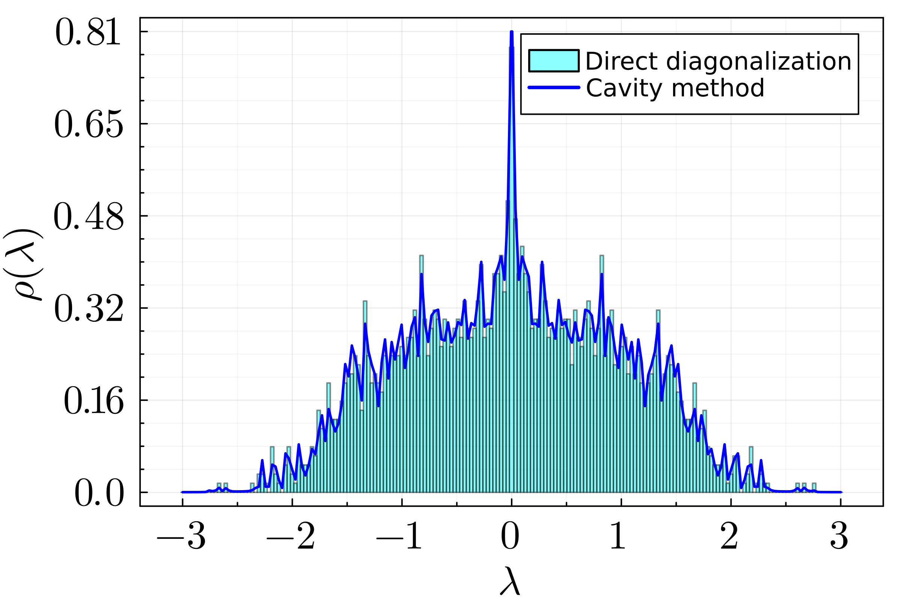
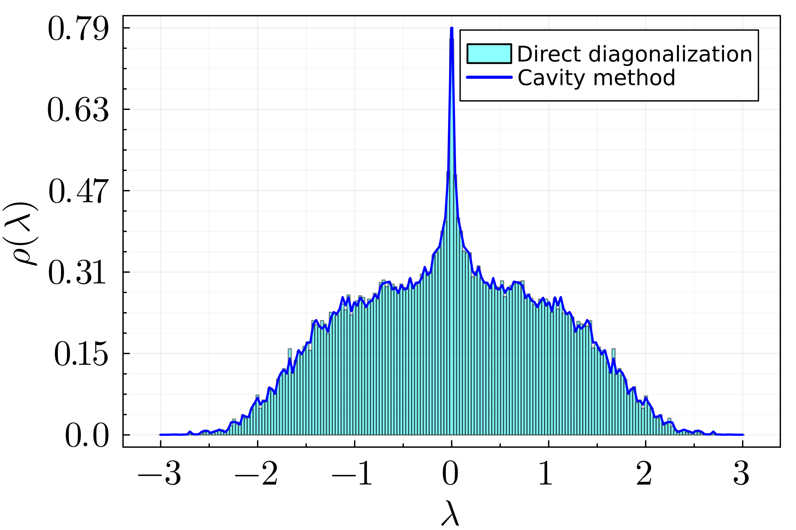

# Random Matrix Theory in Random Regular Graphs

In this part we apply the cavity method to matrices consisting of Random Regular Graphs (RRG) with Gaussian-distributed edge weights. The method is used to compute the spectral density and its performance is compared to that of direct diagonalization.

The task is divided into two parts:
1. Create matrices as described above and obtain their eigenvalues by direct diagonalization. This is used to understand Wigner's semi-circle law and the relation between matrix size and connectivity.
2. Implement the cavity method for the solution of the spectral density and compare with the histogram of direct diagonalization.

Each of these tasks is performed in a Jupyter notebook. The instructions for both of them are to run the cells in the following order:
1. Load packages and define functions
2. Generate data
3. Make plot

## 1. Direct diagonalization

In order to generate a matrix from the ensemble described above, we need to specify the following
```julia
N  # Linear size of the matrix
c  # Mean connectivity.
μ  # Mean of the Gaussian distribution.
σ  # Standard deviation of the Gaussian distribution.
```
Here we always take $\mu = 0$ and $\sigma=1/\sqrt{c}$, so they are set as default values.

The function creating matrices from the ensemble is
```julia
function make_matrix(N, c; μ=0, σ=1/sqrt(c))
    
    graph = random_regular_graph(N, c)
    A = adjacency_matrix(graph)
    
    d = Normal(μ, σ)
    J = Symmetric(rand(d, (N, N)))
    
    M = Symmetric(A .* J)
    
    return M
end
```
The specification of 'Symmetric' in the definition of 'M' is due to the fact that the element-wise product 'A .* J' yields a regular matrix object.

After creating a matrix from the ensemble, the eigenvalues are obtained with LinearAlgebra.jl.

Here the spectral density is displayed as a histogram. Since the integral of the spectral density equals 1, the histogram is normalized accordingly through the keyword 'normalize=:pdf', which makes the sum of the areas of the bars equal to 1.
```julia
histogram(eigenvalues_of_M, normalize=:pdf)
```

### Results

| N = 2^10, c = 3, 10 samples | N = 2^12, c = N-1, 10 samples |
:-------------------------:|:-------------------------:
  |  

## 2. Cavity method

For the cavity method, the generation of the matrices from the ensemble is the same as in the direct diagonalization case. However, in this case we also need to specify the following parameters:

```julia
ϵ  # Added imaginary part to the eigenvalues of the matrix.
tolerance  # Maximum absolute change allowed for the cavity precisions to converge.
iterations  # Maximum number of iterations to achieve convergence.
λ_min  # Minimum positive eigenvalue to probe.
λ_max  # Maximum positive eigenvalue to probe.
points  # Number of points to probe.
```

Because the spectral density is even, we can simply compute a positive or negative range of values and complete the other side accordingly. Therefore, the eigenvalues to probe are formed as

```julia
λ_range = range(λ_min, λ_max, length=points)
```

Since we consider low values of mean connectivity $c$ and for each matrix $M$ we require to solve the cavity precisions for several possible values of $\lambda$, we first create auxiliary arrays. The point of these is to avoid accesing different values of the matrix $M$ in a non-sequential manner. This is performed by the function

```julia
function make_recursion_arrays(M)
    
    c = sum(M[1, :] .!= 0.)
    N = size(M)[1]
    
    M2 = Symmetric(M .* M)  # Element-wise-squared.
    
    cavity_m = zeros(c-1, N*c)
    margin_m = zeros(c, N)
    
    pos_list = []  # Positions of cavity precisions in array.
    
    col = 1  # Counter for columns of cavity_m.
    
    for j ∈ 1:N
        
        j_neigh = [k for k ∈ 1:N if M[j, k] != 0]
        margin_m[:, j] .= M2[j_neigh, j]
        
        for k ∈ j_neigh
            knj_neigh = [l for l in 1:N if M[k, l] != 0 && l != j]
            cavity_m[:, col] .= M2[knj_neigh, k]
            ω_positions = [(k-1)*c + sum(M[1:l,k] .!= 0) for l in knj_neigh]
            
            push!(pos_list, ω_positions)
            
            col += 1
        end
    end
    
    return cavity_m, margin_m, pos_list
end
```

Such arrays need to be created once per sample of $M$ and stay the same for each value of $\lambda$.

The iterative application of the equation for the cavity precisions is performed by

```julia
function update_precisions!(ω, z, cavity_m, pos_list)
    Δω_max = 0
            
    for i in 1:N*c
        ω_old = ω[i]  # Save value we're updating
        ids = pos_list[i]
        ω[i] = z + sum(cavity_m[:, i] ./ ω[ids])
        Δω = abs(ω[i] - ω_old)
        (Δω > Δω_max) && (Δω_max = Δω)
    end
    
    return Δω_max
end
```

and with both of these functions, the cavity method is implemented as follows

```julia
function cavity_method(M, ϵ, λ_range; tolerance=1e-6, max_iter=1000)
    
    c = sum(M[1, :] .!= 0.)  # Mean connectivity.
    N = size(M)[1]  # Linear size of the matrix M.
    
    points = length(λ_range)
    
    cavity_m, margin_m, pos_list = make_recursion_arrays(M)
    
    ρ_values = zeros(points)
    
    # Initial values for the cavity precisions.
    ω = rand(Complex{Float64}, N*c)
    
    @showprogress for k ∈ 1:points
        
        λ = λ_range[k]
        z = im*(λ - im*ϵ)
        
        # Attempt to reach fixed point for cavity precisions.
        for iteration in 1:max_iter
            
            Δω_max = update_precisions!(ω, z, cavity_m, pos_list)
            (Δω_max < tolerance) && break
            (iteration == max_iter) && println("Exhausted iterations at $(λ).")
        end
        
        # Compute the marginal precisions.
        cavity_ω = reshape(ω, (c, N))
        margin_ω = z .+ sum(margin_m ./ cavity_ω, dims=1)
        
        # Compute ρ(λ)
        ρ = imag(sum(im ./ margin_ω)) / (π * N)
        ρ_values[k] = ρ
    end
    
    return ρ_values
end
```

### Results

Below we display the result of the cavity method vs direct diagonalization for matrices of linear size $N = 2^{11}$, mean connectivity $c=3$, and $\epsilon = 0.005$ for the cavity method.

| Single realization | 10 samples |
:-------------------------:|:-------------------------:
  |  
